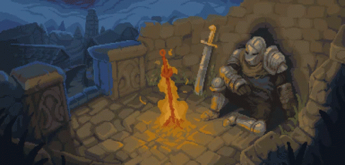

# Hello, chosen Undead coder

Take a rest before to continue your journey, in the realm of code, a solitary programmer ventures forth, their digital armor forged from the binary essence of the digital realm. You will navigate cautiously through the convoluted pathways of the "practice-" folders, where truth and illusion dance in a delicate balance.

With each folder they traverse, the programmer encounters challenges that test their skill and ingenuity. Traps lurk within the code, cunningly concealed to ensnare the unwary. Yet, undeterred, they press forward, their determination unwavering. Within the depths of each "practice-" folder, the programmer faces trials of escalating complexity. Some files tantalize with the promise of success, only to reveal themselves as clever facades, designed to mislead and confound. But the programmer is not so easily swayed. With a discerning eye and sharp intellect, they unravel the deceptions that obscure the true path forward. Through perseverance and diligence, they surmount each obstacle in their path.

With victory achieved, the programmer emerges triumphant, their mission accomplished. Armed with the knowledge gleaned from their trials, they prepare a response to each challenge, ready to confront whatever lies ahead. And so, with a sense of satisfaction, submit a PR to the main repository, their code a testament to their courage and expertise. In the world of code, as in the realm of GitHub, it is the intrepid and resourceful who prevail against the shadows.

*Do you have what it takes to face these challenges?*

## Be careful
- Every commit in spanish will be punish.
- Do not following the rules drive in certainly death, so read every challenge with caution.
- Good to see this [motivation](https://www.youtube.com/watch?v=nJ1DqkEFG9U) to learn more english.

### May the sun bless you traveler
